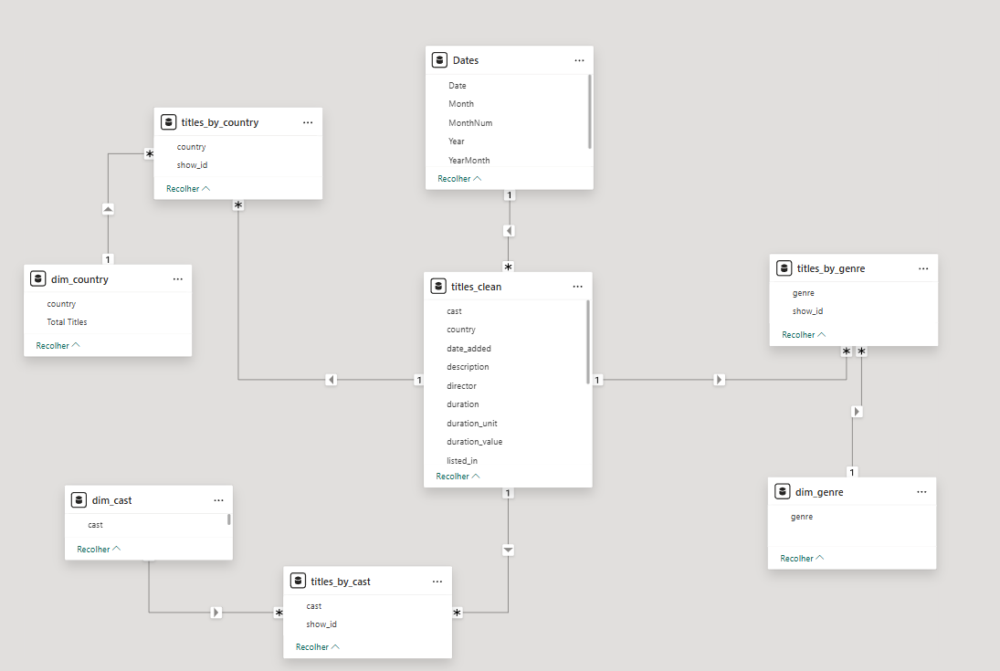

# 🎬 Netflix Analytics — do CSV ao Dashboard (SQL, Python & Power BI)

Projeto de análise de dados construído para um teste técnico. Aqui mostro engenharia + análise + BI com foco em clareza, reprodutibilidade e qualidade visual.

## Objetivo
Construir um pipeline enxuto para analisar o catálogo da Netflix (dataset público "netflix_titles.csv") e responder perguntas de negócio com gráficos e métricas.

## Etapas do Pipeline

### 1) Ingestão
- Importação do CSV para SQLite (titles_raw).
- Boas práticas: tipos corretos, encoding e auditoria de linhas.
- Passo a passo completo: [ingestao.ipynb](./scr/ingestao.ipynb).

### 2) Tratamento
- Padronização de colunas em snake_case e normalização para minúsculas.
- Conversão de date_added para DATE.
- duration separada em duration_value e duration_unit.
- Preenchimento de nulos: country= unknown, rating= not_rated.
- Normalização de campos multivalorados em tabelas ponte:
  - titles_by_country (título × país)
  - titles_by_genre (título × gênero)  
- Passo a passo completo: [tratamento.ipynb](./scr/tratamento.ipynb).

### 3) Análise e Visualizações
Perguntas de negócio respondidas no dashboard (com queries no notebook):
1. Top países com mais títulos.  
2. Evolução mensal de títulos adicionados.  
3. Distribuição filmes × séries.  
4. Elenco: quem mais aparece no catálogo.  

Detalhes, consultas e validações: [analise_sql.ipynb](./scr/analise.ipynb).

---

## Modelo de Dados no BI
- Fato/base: titles_clean  
- Pontes: titles_by_country, titles_by_genre  
- Dimensões: dim_country, dim_genre derivadas das pontes

---
## Dashboard

## Decisões Técnicas
- SQLite pela simplicidade e reprodutibilidade em teste técnico.
- Explode de campos multivalorados em tabelas ponte para permitir análises corretas e joins mais previsíveis.
- Padronização lowercase reduz problemas de agrupamento.

---

